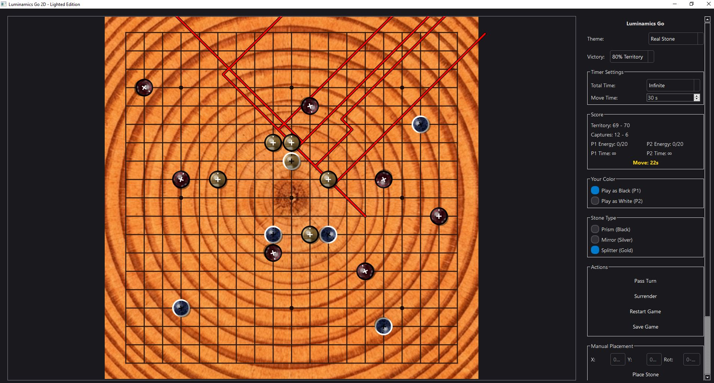
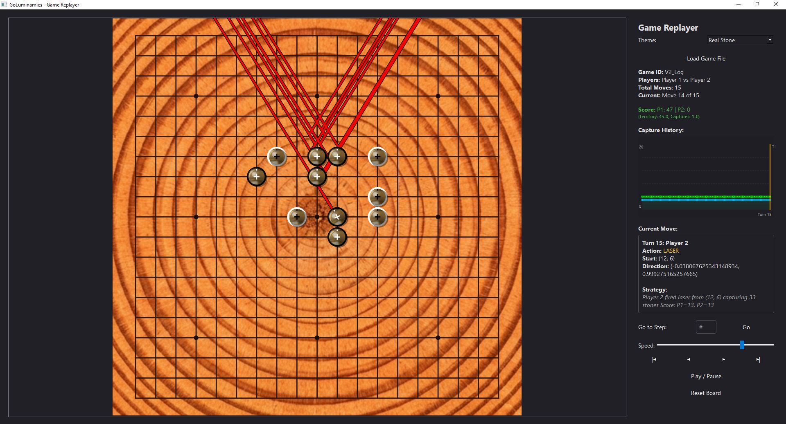
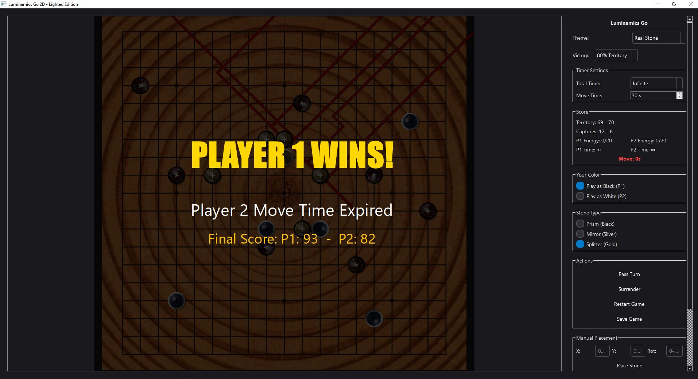

# 🌟 GoLuminamics

<div align="center">

**A Strategic Board Game Where Light Becomes Your Path to Victory**

**Made with ❤️ and ☕ by the GoLuminamics Team**

[](https://ko-fi.com/plantacerium)

⭐ **Star us on GitHub** if you enjoy the game! ⭐
</div>


## 🎯 What is GoLuminamics?

GoLuminamics is a **strategic territory control game** that combines the depth of Go with the physics of light. Place optical stones (prisms, mirrors, splitters) on a configurable board (9×9 to 39×39) and fire laser beams to illuminate territory and capture opponent pieces.

### ✨ Key Features

- 🔮 **Three Stone Types**: Prisms (transmit), Mirrors (reflect), Splitters (branch)
- ⚡ **Real-Time Laser Physics**: Watch beams bounce, split, and illuminate the board
- 📐 **Adjustable Board Size**: 9×9 to 39×39 grids for different game lengths
- ♾️ **Flexible Game Modes**: Infinite energy, infinite score (no mercy rule), customizable timers
- 🎨 **Beautiful Visuals**: Neon laser effects with smooth animations
- 💾 **Game Recording**: Save and replay your matches
- 🏆 **Multiple Victory Conditions**: Territory control, time-based, or surrender

---

## 🖼️ Screenshots

<div align="center">

### Main Game Board

*Strategic stone placement with laser beam visualization*

### Main Replayer Board


### Victory Screen


</div>

---

## 🚀 Quick Start

```bash
# Install dependencies
pip install -r requirements.txt

# Launch the game
python -m _00_entry.main_game

# Launch the replayer
python -m _00_entry.main_replayer
```

---

## 🎮 How to Play

### Game Objective
Control more territory than your opponent by strategically placing stones and firing lasers to illuminate the board.

### Stone Types

| Stone | Symbol | Effect | Energy Cost |
|-------|--------|--------|-------------|
| **Prism** | 🔺 | Transmits laser straight through | 1 |
| **Mirror** | 📐 | Reflects laser at angle | 1 |
| **Splitter** | 💎 | Splits laser into two beams | 1 |

### Basic Rules

1. **Placement Phase**: Players alternate placing stones on empty intersections
2. **Rotation**: Rotate stones to control laser direction (0-360°)
3. **Energy System**: Start with 10 energy, gain 2 per turn (or enable Infinite Energy)
4. **Laser Firing**: Lasers enter from board edges and interact with stones
5. **Territory**: Illuminated intersections count as your territory
6. **Captures**: Lasers hitting opponent stones capture them (+2 points each)

### Victory Conditions

- 🏁 **Mutual Pass**: Both players pass → Highest score wins
- 👑 **Total Victory**: Score difference > 50 OR control > 80% territory (configurable, or disable with Infinite Score)
- ⏱️ **Time Expires**: When timer runs out → Highest score wins
- 🏳️ **Surrender**: Opponent gives up

### Controls

| Action | Key/Mouse |
|--------|-----------|
| Place Stone | Left Click |
| Rotate Stone | Right Click |
| Fire Laser | Space Bar |
| Pass Turn | P key |
| Undo Move | Ctrl+Z |
| Save Game | Ctrl+S |
| Surrender | Esc → Surrender |

---

## 🎨 Game Design Philosophy

Luminamics was designed with these principles:

- **🧠 Strategic Depth**: Easy to learn, lifetime to master
- **⚡ Fast Gameplay**: Matches complete in 15-30 minutes
- **🎯 Skill-Based**: Minimal randomness, maximum strategy
- **🎨 Visual Clarity**: Beautiful but functional UI
- **♿ Accessible**: Keyboard shortcuts and clear feedback

---

## 📜 License

This project is licensed under the GPL V3 License - see the [LICENSE](LICENSE) file for details.

For information about third-party dependencies and their licenses, please see [THIRD_PARTY_NOTICES.md](THIRD_PARTY_NOTICES.md).

---

## 🙏 Acknowledgments

- Inspired by the ancient game of Go
- Built with [PySide6](https://pypi.org/project/PySide6/) (Qt for Python)
- Packaged with [PyInstaller](https://pyinstaller.org/)

---

<div align="center">

**Made with ❤️ and ☕ by the GoLuminamics Team**

[](https://ko-fi.com/plantacerium)

⭐ **Star us on GitHub** if you enjoy the game! ⭐

</div>
